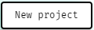

# Glitch

### Automatic Setup

1. &#x20;Setup an account on glitch.com
2. Paste this link into your web browser: [https://glitch.com/edit/#!/import/github/hman124/bell-countdown](https://glitch.com/edit/#!/import/github/hman124/bell-countdown)
3. Continue at step 6 under Manual Setup

### Manual Setup

1. Create an account on Glitch.com
2. Click on the button in the top left corner of the screen.
3. In the dropdown, press the.png>)button.
4. In the new pop up, paste in \`[https://github.com/hman124/bell-countdown.git](https://github.com/hman124/bell-countdown.git)\`
5. Press ok.
6. Find the `package.json` file.&#x20;
7. Add a comma, and paste this in at the bottom, just before the second-to-last `}`

```json
"glitch": {
    "projectType": "generated_static"
  }
```
